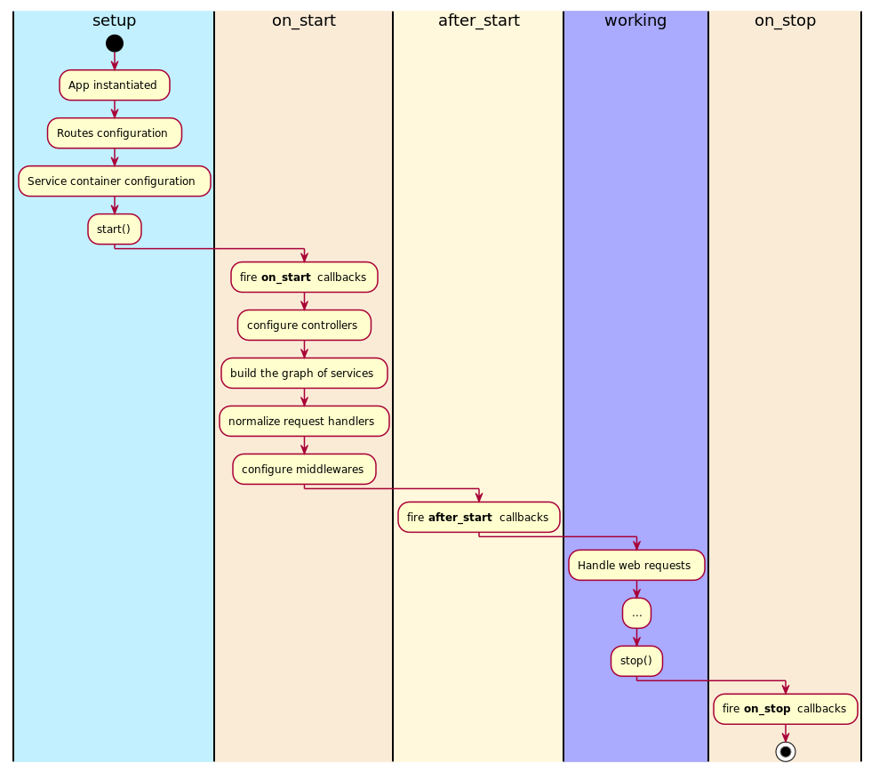

# Application

- the Application class
- exception_handlers attributes
- exception_handler decorator
- manage services which depend on application life cycle
- on_start, after_start & on_stop attributes
- register & dispose services using lifespan decorator

